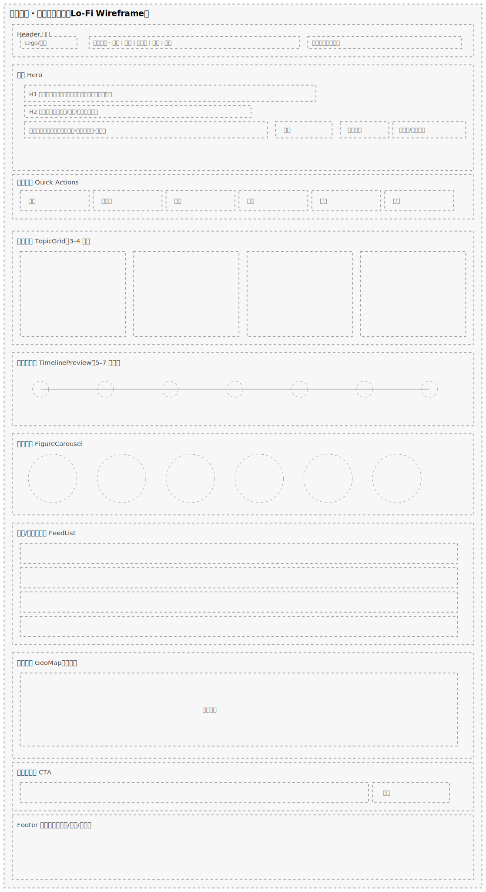
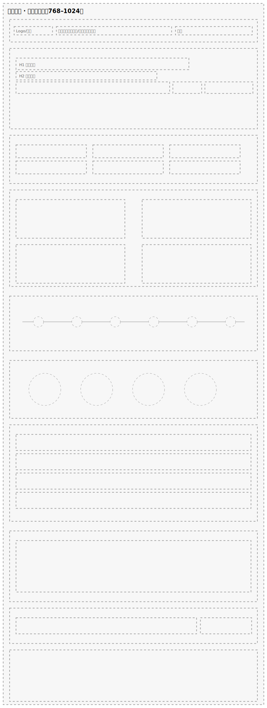
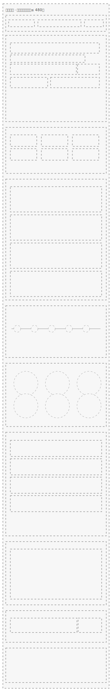
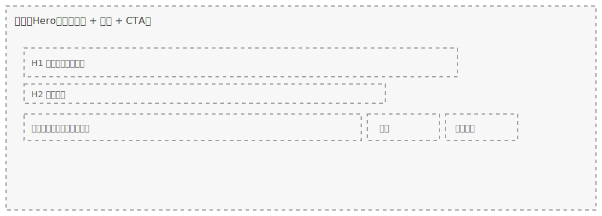
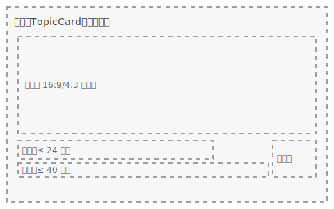
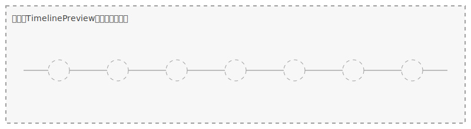
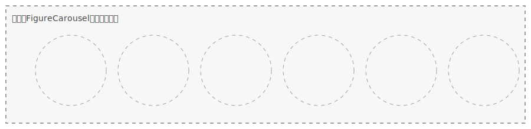
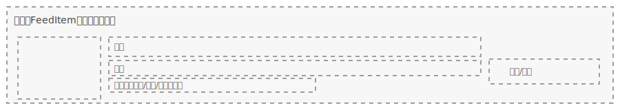

# 界面设计规范（国风主题）

本文档用于规范后台登录页、后台仪表盘与前台首页的视觉与交互设计，确保整体风格统一、信息清晰、体验一致。

## 设计目标
- 简洁、直观：快速完成主要操作（如登录、数据浏览、内容探索）。
- 国风与现代结合：水墨与书法元素融入现代界面，兼顾美观与可用性。
- 可读与可用：优先保证对比度、字号与间距，动效克制不喧宾夺主。

## 共用视觉语言
- 色彩基调：
  - 主色：墨黑、朱红、金色、深灰。
  - 辅助色：浅金、浅灰、墨绿色、暖灰。
- 字体与字重：
  - 标题可使用装饰性书法风格（隶书/行书）作为点缀；正文、表单、图表一律使用屏幕易读的现代中文字体（如思源黑体/苹方等）。
  - 书法字体仅用于标题或装饰，不用于正文与输入框内容，确保可读性与一致性。
- 纹理与背景：
  - 可采用淡墨山水、云雾纹理或浅色木纹作为背景，保持低对比度与低噪点，不干扰信息展示。
  - 渐变与晕染可用于引导注意力（如聚焦登录框、主视觉区域）。
- 组件边框与装饰：
  - 细金线、祥云纹样作为点缀；圆角适度，避免过度装饰影响可读性。
- 动效原则：
  - 轻量、克制、服务信息表达。出现/消失使用淡入淡出或轻微位移；悬停/点击使用细微高亮或墨迹扩散。

---

## 后台登录页
### 目标
- 快速登录、降低干扰；体现轻量国风气质。

### 布局与背景
- 背景：淡墨山水或轻云雾纹理，局部使用渐变增强层次与聚焦。
- 视觉聚焦：通过背景明暗对比与中心渐亮，引导视线到登录框。

### 登录框与表单
- 登录框：半透明白或浅木纹底，边缘可用细金线或祥云纹装饰；留足内外边距。
- 表单：
  - 标签与占位文字使用现代中文字体，字号不小于 14px，行高舒适。
  - 输入框状态（默认/悬停/聚焦/错误）需对比明确；错误信息就近呈现。
- 按钮：
  - 主要按钮（登录）使用朱红色，细金色描边；悬停轻微提亮，点击可配合墨迹扩散动效。
  - 次要链接（忘记密码/注册）使用次要色，间距与对齐统一。

### 动效与可用性
- 进入动画：登录框轻微淡入或向上浮现，时长 200–300ms。
- 悬停反馈：按钮边缘微光或描边提亮；避免过强闪烁。
- 可访问性：对比度符合可读标准；键盘可达、焦点可见；错误提示清晰可辨。

---

## 后台仪表盘
### 目标
- 高信息密度但层次清晰；数据一目了然，操作路径明确。

### 背景与框架
- 背景：浅墨或浅灰底，云雾/晕染仅作远景纹理，不与数据争抢注意力。
- 顶部导航：包含 Logo/标题、搜索/操作入口、用户菜单；可使用半透明背景与细描边分隔。
- 左侧菜单：
  - 分组清晰、图标简练（可引入传统文化意象的几何化图标）。
  - 选中态/悬停态显著；按下可用轻微墨迹扩散。

### 主内容区与卡片
- 布局：卡片式信息块，网格对齐；卡片留白与间距统一。
- 卡片样式：圆角适度；边缘可用金色或朱红点缀；标题与操作区域分明。
- 数据图表：
  - 折线/柱状/饼图等配色遵循主辅色体系；网格线与坐标轴弱化处理。
  - 标题与数值对比度高；关键指标可配合小型装饰纹理。
- 交互反馈：
  - 悬停浮层/高亮，数值轻微放大或颜色强化；更新时使用渐变过渡或细腻墨扩散。

### 色彩建议
- 主色：墨黑、朱红、金色、深灰。
- 辅助：浅金、浅灰、墨绿色；谨慎使用饱和色，避免喧宾夺主。

---

## 前台首页
### 头部（Header）
- Logo 与标题：书法风格字形结合国风图标（云纹/龙纹），与整体色调一致。
- 导航：菜单项清晰，悬停有轻微墨迹扩散或金色闪光；下拉使用柔和渐变与阴影。
- 搜索：简洁边框与轻纹理装饰；输入时可辅以细微墨扩散动效。

### 主视觉（Hero）
- 背景：大幅水墨风景（如江河/山岭），使用云雾与深浅渐变增强空间感。
- 标题/副标题：主标题可用装饰性书法字形，副标题用现代中文字体承载说明。
- 行动按钮：朱红主按钮配金色描边；提供“了解更多/开始探索”等明确行动。

### 历史时间轴（Timeline）
- 表达：按时代分段（如唐/宋/魏晋南北朝等），结合简化传统图标。
- 交互：滚动时逐项显现，伴随轻微水墨渲染过渡；点击进入详情页或侧栏。

### 文化专题（Features）
- 模块化展示：诗词、人物、建筑、事件等专题以卡片呈现；标题可用书法风格字形点缀。
- 悬停与点击：卡片边缘微金光；点击轻微缩放并导航至详情。
- 加载：滚动加载新内容，过渡顺滑连贯。

### 历史人物（Figures）
- 表达：剪影式插画，辅以卷轴/纹样；下方提供精炼简介（现代中文字体）。
- 动效：滚动时淡入/渐显，避免过度运动造成干扰。

### 页脚（Footer）
- 版权信息：小字号、对齐整齐；与主题风格协调。
- 社交链接：采用简洁图标（微博/微信/QQ 等），与法务链接并列呈现。

---

### 信息架构与线框规范（可直接落地）
- 首屏（Above the fold）
  - H1（价值主张）：一句话解释“是什么/能做什么/为谁服务”。
  - H2（补充说明）：12–18 字内，解释内容结构与优势。
  - 强搜索入口：大搜索框 + 热门搜索/示例提示（如“例：李白·诗歌，宋代·瓷器，丝绸之路”）。
  - 行动按钮：主 CTA“开始探索”，次 CTA“按时代浏览/按专题浏览”。
  - 快捷入口卡片（3–6 个）：专题、时间轴、人物、地图、文库、课程。
- 页面模块与顺序（建议）
  1. 精选专题 TopicGrid（3–4 卡）
  2. 时间轴快览 TimelinePreview（5–7 节点）
  3. 热门人物 FigureCarousel（8–12 人）
  4. 最新/热门信息流 FeedList（分页或懒加载）
  5. 文化地图 GeoMap（地域入口，可选）
  6. 社群与订阅 CTA（加入讨论/收藏/贡献/订阅）
- 组件清单（建议命名）
  - Hero、SearchBar、QuickActions、TopicGrid、TimelinePreview、FigureCarousel、FeedList、GeoMap、NewsletterCTA。
- 路由与参数
  - /topics、/timeline、/figures、/collections、/map、/search?q=。
  - 支持组合筛选：?dynasty=、?type=、?tag=、?sort=(latest|hot)。

### 卡片与字段规范（数据对接）
- 通用卡片字段（示例）
  - id：唯一标识
  - type：内容类别（见枚举 ContentType）
  - title：标题（不超过 24 字）
  - summary：一句话摘要（不超过 40 字）
  - coverUrl：封面图（16:9/4:3 自适应裁切）
  - dynasty：所属朝代（见枚举 Dynasty，可选）
  - tags：标签（开放集合）
  - updatedAt：更新时间（用于“最新/热门”排序与展示）
- 交互规范
  - 悬停：细金线描边提亮 + 封面轻微放大（1.02x）
  - 点击：整卡可点击；阴影短暂增强，120–180ms 回弹

### 枚举建议（供前端/服务端统一使用）
```ts
// 固定类别/选项统一使用枚举（数字常量）
export enum ContentType {
  Topic = 1,
  Timeline = 2,
  Figure = 3,
  Collection = 4,
  Map = 5,
  Article = 6,
  Course = 7
}

export enum Dynasty {
  PreQin = 1,
  Qin = 2,
  Han = 3,
  WeiJinNorthSouth = 4,
  Sui = 5,
  Tang = 6,
  Song = 7,
  Yuan = 8,
  Ming = 9,
  Qing = 10,
  Modern = 11
}

export interface TopicCard {
  id: string;
  type: ContentType; // 必须为枚举
  title: string;
  summary: string;
  coverUrl: string;
  dynasty?: Dynasty; // 可选，使用枚举
  tags: string[];
  updatedAt: string; // ISO 日期
}
```

### 空态/加载/错误
- 空态：给出热搜关键词、热门专题与“去时间轴看看”。
- 加载：骨架屏，首屏组件优先加载；图片使用渐进式加载。
- 错误：保底提示 + 重试；搜索失败提供“按分类浏览”。

### 成功指标与实验
- 指标
  - 首屏 CTA 点击率、搜索框交互率、首屏到二屏滚动率。
  - Topic/Timeline/Figure 三类入口点击分布、专题卡点击率。
- A/B 实验
  - 有/无快捷入口；时间轴位置（首屏/二屏）。
  - 搜索提示文案与热搜数量；卡片摘要长度（12/24/40 字）。

### 可访问性与性能
- 对比度达标（文本/背景建议 ≥ 4.5:1）；键盘可达、焦点可见。
- 移动端优先：首屏核心操作 1–2 次点击可达；图片按需/懒加载。
- 动效优先使用 GPU 合成属性；动画时长 100–300ms 区间。

### 低保真线框图（Lo‑Fi）
- 预览下图把首页主要模块按从上到下的顺序呈现，适合作为设计与前端沟通的参考框架。
- 文件路径：`assets/wireframes/homepage-wireframe.svg`



### 响应式线框图（Tablet / Mobile）
- 平板（768–1024）：两列栅格为主，导航可保留文字菜单或折叠为“更多”。
- 移动（≤ 480）：单列纵向，Hero、快捷入口、信息流按优先级顺序堆叠，保证搜索与 CTA 可见。





### 模块级线框图（组件参考）
- 目的：方便组件拆分与并行开发，保持规格统一。
- Hero（价值主张 + 搜索 + CTA）



- TopicCard（专题卡）



- TimelinePreview（时间轴快览）



- FigureCarousel（人物轮播）



- FeedItem（信息流条目）



## 交互与动画规范
- 悬停（100–150ms）：轻微提亮/阴影/描边变化；不改变布局。
- 点击（120–180ms）：按压/墨迹扩散；迅速反馈、及时回弹。
- 进入/离开（200–300ms）：淡入淡出或轻位移；避免长时间遮挡。
- 滚动加载：惰性加载结合渐显/晕染；保持帧率稳定。
- 缓动曲线：优先使用 ease-out/ease-in-out，减少生硬感。
- 性能约束：图层数与特效粒度可控，移动端优先 GPU 合成属性。

## 色彩搭配摘要
- 主色：墨黑（背景/文字）、朱红（主按钮/强调）、金色（描边/点缀）、深灰（分隔/次要文案）。
- 辅助：浅金、浅灰、墨绿色、暖灰用于背景层次与信息分级。
- 对比度：关键信息对比度充足；大面积深色背景上使用高亮文本与清晰描边。

## 总结
- 后台登录页：以水墨背景与轻装饰为基调，强调聚焦与易用。
- 仪表盘：卡片式信息架构，动效克制，数据清晰可辨。
- 前台首页：主视觉突出品牌气质，探索路径明确，动效服务内容。

本规范为设计与实现的共同依据，后续可根据用户研究与数据反馈持续迭代优化。
