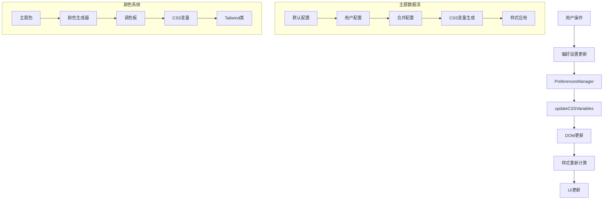

# Vben项目主题设计系统架构分析

## 目录
- [1. 主题系统核心架构设计](#1-主题系统核心架构设计)
- [2. 关键依赖包作用及集成方式](#2-关键依赖包作用及集成方式)
- [3. 主题定制化机制](#3-主题定制化机制)
- [4. 样式作用域控制方案](#4-样式作用域控制方案)
- [5. 典型配置示例](#5-典型配置示例)
- [6. 不同主题方案对比](#6-不同主题方案对比)

## 1. 主题系统核心架构设计

### 1.1 分层结构

Vben项目采用了清晰的分层架构，主题系统贯穿各个层级：

```
┌─────────────────────────────────────────┐
│              应用层 (Apps)               │
│  ┌─────────────┬─────────────┬─────────┐ │
│  │  web-antd   │   web-ele   │web-naive│ │
│  └─────────────┴─────────────┴─────────┘ │
└─────────────────────────────────────────┘
┌─────────────────────────────────────────┐
│             效果层 (Effects)             │
│  ┌─────────────┬─────────────┬─────────┐ │
│  │ common-ui   │   layouts   │ plugins │ │
│  └─────────────┴─────────────┴─────────┘ │
└─────────────────────────────────────────┘
┌─────────────────────────────────────────┐
│             包层 (Packages)              │
│  ┌─────────────┬─────────────┬─────────┐ │
│  │   styles    │   locales   │  utils  │ │
│  └─────────────┴─────────────┴─────────┘ │
└─────────────────────────────────────────┘
┌─────────────────────────────────────────┐
│            核心层 (@core)                │
│  ┌─────────────┬─────────────┬─────────┐ │
│  │preferences  │   design    │ ui-kit  │ │
│  └─────────────┴─────────────┴─────────┘ │
└─────────────────────────────────────────┘
┌─────────────────────────────────────────┐
│          内部工具层 (Internal)           │
│  ┌─────────────┬─────────────┬─────────┐ │
│  │tailwind-cfg │ lint-configs│vite-cfg │ │
│  └─────────────┴─────────────┴─────────┘ │
└─────────────────────────────────────────┘
```

### 1.2 主题系统模块划分

#### 核心模块结构
```
packages/@core/
├── preferences/                    # 偏好设置管理
│   ├── src/
│   │   ├── config.ts              # 默认配置
│   │   ├── types.ts               # 类型定义
│   │   ├── constants.ts           # 主题预设常量
│   │   ├── preferences.ts         # 偏好设置管理器
│   │   ├── update-css-variables.ts # CSS变量更新逻辑
│   │   └── use-preferences.ts     # 组合式API
├── base/design/                   # 设计系统基础
│   ├── src/
│   │   ├── design-tokens/         # 设计令牌
│   │   │   ├── index.ts          # 入口文件
│   │   │   ├── default.css       # 默认主题变量
│   │   │   └── dark.css          # 暗色主题变量
│   │   ├── scss-bem/             # BEM规范
│   │   │   ├── bem.scss          # BEM混入
│   │   │   └── constants.scss    # SCSS常量
│   │   └── css/                  # 全局样式
│   │       ├── global.css        # 全局基础样式
│   │       ├── transition.css    # 过渡动画
│   │       └── ui.css           # UI组件样式
└── base/shared/                  # 共享工具
    ├── src/
    │   ├── color/               # 颜色处理工具
    │   │   ├── generator.ts     # 颜色生成器
    │   │   ├── convert.ts       # 颜色转换
    │   │   └── index.ts        # 颜色工具入口
    │   └── utils/              # 工具函数
    │       └── update-css-variables.ts # CSS变量更新工具
```

### 1.3 主题系统数据流



## 2. 关键依赖包作用及集成方式

### 2.1 核心依赖分析

#### 2.1.1 theme-colors
**作用**: 基于单一颜色生成完整的颜色调色板

```typescript
// packages/@core/base/shared/src/color/generator.ts
import { getColors } from 'theme-colors';

function generatorColorVariables(colorItems: ColorItem[]) {
  const colorVariables: Record<string, string> = {};

  colorItems.forEach(({ alias, color, name }) => {
    if (color) {
      // 使用theme-colors生成50-950的颜色阶梯
      const colorsMap = getColors(new TinyColor(color).toHexString());
      
      Object.keys(colorsMap).forEach((key) => {
        const colorValue = colorsMap[key];
        if (colorValue) {
          const hslColor = convertToHslCssVar(colorValue);
          colorVariables[`--${name}-${key}`] = hslColor;
          if (alias) {
            colorVariables[`--${alias}-${key}`] = hslColor;
          }
        }
      });
    }
  });
  return colorVariables;
}
```

#### 2.1.2 CSS Variables 系统
**作用**: 实现动态主题切换的核心机制

```typescript
// packages/@core/preferences/src/update-css-variables.ts
function updateCSSVariables(preferences: Preferences) {
  const root = document.documentElement;
  if (!root) return;

  const theme = preferences?.theme ?? {};
  const { builtinType, mode, radius } = theme;

  // 1. 设置暗色模式类名
  if (Reflect.has(theme, 'mode')) {
    const dark = isDarkTheme(mode);
    root.classList.toggle('dark', dark);
  }

  // 2. 设置主题数据属性
  if (Reflect.has(theme, 'builtinType')) {
    const rootTheme = root.dataset.theme;
    if (rootTheme !== builtinType) {
      root.dataset.theme = builtinType;
    }
  }

  // 3. 更新主题颜色变量
  updateMainColorVariables(preferences);

  // 4. 更新圆角变量
  if (Reflect.has(theme, 'radius')) {
    document.documentElement.style.setProperty('--radius', `${radius}rem`);
  }
}
```

#### 2.1.3 动态CSS变量注入
**作用**: 运行时动态更新CSS变量

```typescript
// packages/@core/base/shared/src/utils/update-css-variables.ts
function updateCSSVariables(
  variables: { [key: string]: string },
  id = '__vben-styles__',
): void {
  // 获取或创建内联样式表元素
  const styleElement =
    document.querySelector(`#${id}`) || document.createElement('style');

  styleElement.id = id;

  // 构建CSS变量样式文本
  let cssText = ':root {';
  for (const key in variables) {
    if (Object.prototype.hasOwnProperty.call(variables, key)) {
      cssText += `${key}: ${variables[key]};`;
    }
  }
  cssText += '}';

  // 注入到文档头部
  styleElement.textContent = cssText;
  if (!document.querySelector(`#${id}`)) {
    setTimeout(() => {
      document.head.append(styleElement);
    });
  }
}
```

### 2.2 Tailwind CSS 集成

#### 2.2.1 主题配置映射
```typescript
// internal/tailwind-config/src/index.ts
const shadcnUiColors = {
  primary: {
    ...createColorsPalette('primary'),
    DEFAULT: 'hsl(var(--primary))',
  },
  background: {
    deep: 'hsl(var(--background-deep))',
    DEFAULT: 'hsl(var(--background))',
  },
  accent: {
    DEFAULT: 'hsl(var(--accent))',
    foreground: 'hsl(var(--accent-foreground))',
    hover: 'hsl(var(--accent-hover))',
  },
  // ... 更多颜色定义
};

// 动态颜色调色板生成函数
function createColorsPalette(name: string) {
  return {
    50: `hsl(var(--${name}-50))`,
    100: `hsl(var(--${name}-100))`,
    200: `hsl(var(--${name}-200))`,
    300: `hsl(var(--${name}-300))`,
    400: `hsl(var(--${name}-400))`,
    500: `hsl(var(--${name}-500))`,
    600: `hsl(var(--${name}-600))`,
    700: `hsl(var(--${name}-700))`,
    // 语义化颜色
    hover: `hsl(var(--${name}-600))`,
    active: `hsl(var(--${name}-700))`,
    'text-hover': `hsl(var(--${name}-600))`,
    'text-active': `hsl(var(--${name}-700))`,
  };
}
```

#### 2.2.2 全局样式基础
```css
/* packages/@core/base/design/src/css/global.css */
@tailwind base;
@tailwind components;
@tailwind utilities;

@layer base {
  html {
    @apply text-foreground bg-background font-sans text-[100%];
    font-variation-settings: normal;
    scroll-behavior: smooth;
    text-rendering: optimizelegibility;
  }

  #app, body, html {
    @apply size-full;
  }
}

@layer components {
  .flex-center {
    @apply flex items-center justify-center;
  }

  .vben-link {
    @apply text-primary hover:text-primary-hover active:text-primary-active cursor-pointer;
  }

  .card-box {
    @apply bg-card text-card-foreground border-border rounded-xl border;
  }
}
```

### 2.3 SCSS/BEM 系统

#### 2.3.1 BEM命名规范
```scss
// packages/@core/base/design/src/scss-bem/constants.scss
$namespace: 'vben' !default;
$common-separator: '-' !default;
$element-separator: '__' !default;
$modifier-separator: '--' !default;
$state-prefix: 'is' !default;
```

```scss
// packages/@core/base/design/src/scss-bem/bem.scss
@mixin b($block) {
  $B: $namespace + '-' + $block !global;
  .#{$B} {
    @content;
  }
}

@mixin e($name) {
  @at-root {
    &#{$element-separator}#{$name} {
      @content;
    }
  }
}

@mixin m($name) {
  @at-root {
    &#{$modifier-separator}#{$name} {
      @content;
    }
  }
}

@mixin is($state, $prefix: $state-prefix) {
  @at-root {
    &.#{$prefix}-#{$state} {
      @content;
    }
  }
}
```

#### 2.3.2 JavaScript BEM工具
```typescript
// packages/@core/composables/src/use-namespace.ts
const useNamespace = (block: string) => {
  const namespace = 'vben';
  
  const b = (blockSuffix = '') => `${namespace}-${block}${blockSuffix ? `-${blockSuffix}` : ''}`;
  const e = (element?: string) => element ? `${namespace}-${block}__${element}` : '';
  const m = (modifier?: string) => modifier ? `${namespace}-${block}--${modifier}` : '';
  
  const is = (name: string, state = true) => {
    return name && state ? `is-${name}` : '';
  };

  // CSS变量工具
  const cssVar = (object: Record<string, string>) => {
    const styles: Record<string, string> = {};
    for (const key in object) {
      if (object[key]) {
        styles[`--${namespace}-${key}`] = object[key];
      }
    }
    return styles;
  };

  const cssVarBlock = (object: Record<string, string>) => {
    const styles: Record<string, string> = {};
    for (const key in object) {
      if (object[key]) {
        styles[`--${namespace}-${block}-${key}`] = object[key];
      }
    }
    return styles;
  };

  return {
    b, e, m, is,
    cssVar, cssVarBlock,
    namespace,
  };
};
```

## 3. 主题定制化机制

### 3.1 设计令牌系统

#### 3.1.1 默认主题变量
```css
/* packages/@core/base/design/src/design-tokens/default.css */
:root {
  /* 基础颜色 */
  --background: 0 0% 100%;
  --background-deep: 216 20.11% 95.47%;
  --foreground: 210 6% 21%;

  /* 主题色 */
  --primary: 212 100% 45%;
  --primary-foreground: 0 0% 98%;

  /* 语义化颜色 */
  --destructive: 359.33 100% 65.1%;
  --success: 144 57% 58%;
  --warning: 42 84% 61%;

  /* 组件颜色 */
  --card: 0 0% 100%;
  --popover: 0 0% 100%;
  --muted: 240 4.8% 95.9%;
  --accent: 240 5% 96%;
  --border: 240 5.9% 90%;

  /* 布局颜色 */
  --sidebar: 0 0% 100%;
  --header: 0 0% 100%;

  /* 其他 */
  --radius: 0.5rem;
  --font-family: -apple-system, blinkmacsystemfont, 'Segoe UI', roboto;
}

/* 主题变体 */
[data-theme='violet'] {
  --primary: 245 82% 67%;
  --ring: 262.1 83.3% 57.8%;
}

[data-theme='pink'] {
  --primary: 347 77% 60%;
  --ring: 346.8 77.2% 49.8%;
}

/* ... 更多主题变体 */
```

#### 3.1.2 暗色主题变量
```css
/* packages/@core/base/design/src/design-tokens/dark.css */
.dark,
.dark[data-theme='default'] {
  --background: 222.34deg 10.43% 12.27%;
  --background-deep: 220deg 13.06% 9%;
  --foreground: 0 0% 95%;

  --card: 222.34deg 10.43% 12.27%;
  --popover: 0 0% 14.2%;
  --muted: 240 3.7% 15.9%;
  --accent: 216 5% 19%;
  --border: 240 3.7% 22%;

  --sidebar: 222.34deg 10.43% 12.27%;
  --header: 222.34deg 10.43% 12.27%;

  color-scheme: dark;
}

/* 暗色主题变体 */
.dark[data-theme='violet'] {
  --background: 224 71.4% 4.1%;
  --sidebar: 224 71.4% 4.1%;
  --header: 224 71.4% 4.1%;
}
```

### 3.2 主题预设系统

#### 3.2.1 内置主题常量
```typescript
// packages/@core/preferences/src/constants.ts
interface BuiltinThemePreset {
  color: string;
  darkPrimaryColor?: string;
  primaryColor?: string;
  type: BuiltinThemeType;
}

const BUILT_IN_THEME_PRESETS: BuiltinThemePreset[] = [
  {
    color: 'hsl(212 100% 45%)',
    type: 'default',
  },
  {
    color: 'hsl(245 82% 67%)',
    type: 'violet',
  },
  {
    color: 'hsl(347 77% 60%)',
    type: 'pink',
  },
  {
    color: 'hsl(42 84% 61%)',
    type: 'yellow',
  },
  {
    color: 'hsl(240 5% 26%)',
    darkPrimaryColor: 'hsl(0 0% 98%)',
    primaryColor: 'hsl(240 5.9% 10%)',
    type: 'zinc',
  },
  // ... 更多预设
  {
    color: '',
    type: 'custom', // 自定义主题
  },
];
```

### 3.3 动态主题切换

#### 3.3.1 主题切换逻辑
```typescript
// packages/@core/preferences/src/update-css-variables.ts
function updateMainColorVariables(preference: Preferences) {
  if (!preference.theme) return;
  
  const { colorDestructive, colorPrimary, colorSuccess, colorWarning } = preference.theme;

  // 生成颜色变量
  const colorVariables = generatorColorVariables([
    { color: colorPrimary, name: 'primary' },
    { alias: 'warning', color: colorWarning, name: 'yellow' },
    { alias: 'success', color: colorSuccess, name: 'green' },
    { alias: 'destructive', color: colorDestructive, name: 'red' },
  ]);

  // 颜色映射
  const colorMappings = {
    '--green-500': '--success',
    '--primary-500': '--primary',
    '--red-500': '--destructive',
    '--yellow-500': '--warning',
  };

  // 更新CSS变量
  Object.entries(colorMappings).forEach(([sourceVar, targetVar]) => {
    const colorValue = colorVariables[sourceVar];
    if (colorValue) {
      document.documentElement.style.setProperty(targetVar, colorValue);
    }
  });

  // 批量更新变量
  executeUpdateCSSVariables(colorVariables);
}
```

#### 3.3.2 主题模式判断
```typescript
function isDarkTheme(theme: string) {
  let dark = theme === 'dark';
  if (theme === 'auto') {
    dark = window.matchMedia('(prefers-color-scheme: dark)').matches;
  }
  return dark;
}
```

### 3.4 偏好设置管理

#### 3.4.1 主题配置接口
```typescript
// packages/@core/preferences/src/types.ts
interface ThemePreferences {
  /** 内置主题名 */
  builtinType: BuiltinThemeType;
  /** 错误色 */
  colorDestructive: string;
  /** 主题色 */
  colorPrimary: string;
  /** 成功色 */
  colorSuccess: string;
  /** 警告色 */
  colorWarning: string;
  /** 当前主题模式 */
  mode: ThemeModeType;
  /** 圆角大小 */
  radius: string;
  /** 是否开启半深色header */
  semiDarkHeader: boolean;
  /** 是否开启半深色菜单 */
  semiDarkSidebar: boolean;
}
```

#### 3.4.2 默认主题配置
```typescript
// packages/@core/preferences/src/config.ts
const defaultPreferences: Preferences = {
  // ... 其他配置
  theme: {
    builtinType: 'default',
    colorDestructive: 'hsl(348 100% 61%)',
    colorPrimary: 'hsl(212 100% 45%)',
    colorSuccess: 'hsl(144 57% 58%)',
    colorWarning: 'hsl(42 84% 61%)',
    mode: 'dark',
    radius: '0.5',
    semiDarkHeader: false,
    semiDarkSidebar: false,
  },
};
```

## 4. 样式作用域控制方案

### 4.1 BEM + CSS Variables 方案

#### 4.1.1 组件样式示例
```vue
<!-- 布局组件示例 -->
<template>
  <div :class="[b(), theme, { [is('collapsed')]: collapsed }]">
    <div :class="e('header')">
      <div :class="em('header', 'title')">{{ title }}</div>
    </div>
    <div :class="e('content')">
      <slot />
    </div>
  </div>
</template>

<script setup lang="ts">
interface Props {
  theme?: string;
  collapsed?: boolean;
  title?: string;
}

const props = withDefaults(defineProps<Props>(), {
  theme: 'light',
  collapsed: false,
  title: 'Layout',
});

const { b, e, em, is } = useNamespace('layout');
</script>

<style lang="scss" scoped>
@use '@vben-core/design/bem' as *;

@include b(layout) {
  @apply bg-background text-foreground;
  
  @include e(header) {
    @apply bg-header border-b border-border;
    height: var(--header-height, 50px);
    
    @include m(title) {
      @apply font-semibold text-lg;
    }
  }
  
  @include e(content) {
    @apply flex-1 p-4;
  }
  
  @include is(collapsed) {
    @include e(header) {
      @apply transform -translate-x-full;
    }
  }
  
  // 主题变体
  &.dark {
    @include e(header) {
      @apply bg-header-dark;
    }
  }
}
</style>
```

### 4.2 Tailwind CSS 作用域

#### 4.2.1 工具类组合
```vue
<template>
  <div class="bg-background text-foreground min-h-screen">
    <!-- 主题色按钮 -->
    <button class="bg-primary text-primary-foreground hover:bg-primary-hover active:bg-primary-active px-4 py-2 rounded-lg transition-colors">
      Primary Button
    </button>
    
    <!-- 成功色按钮 -->
    <button class="bg-success text-success-foreground hover:bg-success-hover px-4 py-2 rounded-lg">
      Success Button
    </button>
    
    <!-- 卡片组件 -->
    <div class="card-box p-6 shadow-lg">
      <h3 class="text-foreground text-xl font-semibold mb-4">Card Title</h3>
      <p class="text-muted-foreground">Card content goes here...</p>
    </div>
  </div>
</template>
```

#### 4.2.2 响应式主题类
```vue
<template>
  <div :class="[
    'layout-container',
    `theme-${currentTheme}`,
    {
      'is-mobile': isMobile,
      'is-collapsed': sidebarCollapsed,
    }
  ]">
    <!-- 内容 -->
  </div>
</template>

<script setup>
const { theme: currentTheme, isMobile, sidebarCollapsed } = usePreferences();
</script>

<style>
.layout-container {
  @apply transition-all duration-300;
  
  &.theme-dark {
    @apply bg-background-deep;
  }
  
  &.is-mobile {
    @apply px-2;
  }
  
  &.is-collapsed {
    @apply ml-16;
  }
}
</style>
```

### 4.3 CSS-in-JS 动态样式

#### 4.3.1 动态CSS变量
```vue
<template>
  <div 
    :style="dynamicStyles"
    class="custom-component"
  >
    <slot />
  </div>
</template>

<script setup lang="ts">
interface Props {
  primaryColor?: string;
  spacing?: number;
  borderRadius?: string;
}

const props = withDefaults(defineProps<Props>(), {
  primaryColor: '',
  spacing: 16,
  borderRadius: '8px',
});

const { cssVarBlock } = useNamespace('custom');

const dynamicStyles = computed(() => {
  return cssVarBlock({
    'primary-color': props.primaryColor || 'var(--primary)',
    'spacing': `${props.spacing}px`,
    'border-radius': props.borderRadius,
  });
});
</script>

<style scoped>
.custom-component {
  background-color: hsl(var(--vben-custom-primary-color));
  padding: var(--vben-custom-spacing);
  border-radius: var(--vben-custom-border-radius);
}
</style>
```

## 5. 典型配置示例

### 5.1 自定义主题色配置

#### 5.1.1 基础主题定制
```typescript
// 自定义紫色主题
const purpleTheme = {
  theme: {
    builtinType: 'custom' as const,
    colorPrimary: 'hsl(280 100% 70%)',      // 紫色主题
    colorSuccess: 'hsl(120 60% 50%)',       // 绿色成功
    colorWarning: 'hsl(45 100% 60%)',       // 黄色警告
    colorDestructive: 'hsl(0 80% 60%)',     // 红色错误
    mode: 'dark' as const,
    radius: '0.75',
    semiDarkHeader: false,
    semiDarkSidebar: true,
  }
};

// 应用主题
import { updatePreferences } from '@vben-core/preferences';
updatePreferences(purpleTheme);
```

#### 5.1.2 企业级主题配置
```typescript
// 企业蓝主题配置
const enterpriseTheme = {
  theme: {
    builtinType: 'custom' as const,
    colorPrimary: 'hsl(210 100% 50%)',      // 企业蓝
    colorSuccess: 'hsl(142 76% 36%)',       // 深绿色
    colorWarning: 'hsl(38 92% 50%)',        // 橙色警告
    colorDestructive: 'hsl(348 86% 61%)',   // 红色
    mode: 'light' as const,
    radius: '0.25',                         // 小圆角
    semiDarkHeader: true,                   // 半暗色头部
    semiDarkSidebar: false,
  },
  // 其他配置
  app: {
    name: 'Enterprise Admin',
    compact: true,                          // 紧凑模式
  },
  header: {
    height: 56,                            // 更高的头部
  },
  sidebar: {
    width: 280,                            // 更宽的侧边栏
  }
};
```

### 5.2 组件级主题定制

#### 5.2.1 按钮组件主题
```vue
<template>
  <button 
    :class="buttonClasses"
    :style="buttonStyles"
    @click="handleClick"
  >
    <slot />
  </button>
</template>

<script setup lang="ts">
interface Props {
  variant?: 'primary' | 'secondary' | 'success' | 'warning' | 'destructive';
  size?: 'sm' | 'md' | 'lg';
  customColor?: string;
}

const props = withDefaults(defineProps<Props>(), {
  variant: 'primary',
  size: 'md',
});

const { b, m, is } = useNamespace('button');

const buttonClasses = computed(() => [
  b(),
  m(props.variant),
  m(props.size),
  is('custom', !!props.customColor),
]);

const buttonStyles = computed(() => {
  if (!props.customColor) return {};
  
  return {
    '--vben-button-bg': props.customColor,
    '--vben-button-hover': `color-mix(in srgb, ${props.customColor} 90%, black)`,
    '--vben-button-active': `color-mix(in srgb, ${props.customColor} 80%, black)`,
  };
});
</script>

<style lang="scss" scoped>
@use '@vben-core/design/bem' as *;

@include b(button) {
  @apply inline-flex items-center justify-center rounded-lg font-medium transition-colors;
  @apply focus-visible:outline-none focus-visible:ring-2 focus-visible:ring-ring;
  
  @include m(primary) {
    @apply bg-primary text-primary-foreground hover:bg-primary-hover;
  }
  
  @include m(secondary) {
    @apply bg-secondary text-secondary-foreground hover:bg-secondary/80;
  }
  
  @include m(sm) {
    @apply h-8 px-3 text-sm;
  }
  
  @include m(md) {
    @apply h-10 px-4;
  }
  
  @include m(lg) {
    @apply h-12 px-6 text-lg;
  }
  
  @include is(custom) {
    background-color: var(--vben-button-bg);
    color: white;
    
    &:hover {
      background-color: var(--vben-button-hover);
    }
    
    &:active {
      background-color: var(--vben-button-active);
    }
  }
}
</style>
```

#### 5.2.2 表单组件主题
```vue
<template>
  <div :class="[b(), themeClass]">
    <label :class="e('label')" v-if="label">
      {{ label }}
      <span :class="m('required')" v-if="required">*</span>
    </label>
    
    <div :class="e('input-wrapper')">
      <input
        :class="[e('input'), is('error', !!error)]"
        :style="inputStyles"
        v-bind="$attrs"
        @input="handleInput"
      />
      <div :class="e('error')" v-if="error">
        {{ error }}
      </div>
    </div>
  </div>
</template>

<script setup lang="ts">
interface Props {
  label?: string;
  required?: boolean;
  error?: string;
  theme?: 'default' | 'minimal' | 'bordered';
}

const props = withDefaults(defineProps<Props>(), {
  theme: 'default',
});

const { b, e, m, is } = useNamespace('form-item');
const { theme: globalTheme } = usePreferences();

const themeClass = computed(() => m(props.theme));

const inputStyles = computed(() => {
  if (props.theme === 'minimal') {
    return {
      '--vben-form-item-border': 'none',
      '--vben-form-item-bg': 'transparent',
      '--vben-form-item-focus-shadow': 'none',
    };
  }
  return {};
});
</script>

<style lang="scss" scoped>
@use '@vben-core/design/bem' as *;

@include b(form-item) {
  @apply mb-4;
  
  @include e(label) {
    @apply block text-sm font-medium text-foreground mb-2;
    
    @include m(required) {
      @apply text-destructive ml-1;
    }
  }
  
  @include e(input-wrapper) {
    @apply relative;
  }
  
  @include e(input) {
    @apply w-full px-3 py-2 border border-input bg-input-background rounded-lg;
    @apply text-foreground placeholder:text-input-placeholder;
    @apply focus:outline-none focus:ring-2 focus:ring-ring focus:border-transparent;
    @apply transition-colors;
    
    border: var(--vben-form-item-border, 1px solid hsl(var(--input)));
    background: var(--vben-form-item-bg, hsl(var(--input-background)));
    
    &:focus {
      box-shadow: var(--vben-form-item-focus-shadow, 0 0 0 2px hsl(var(--ring)));
    }
    
    @include is(error) {
      @apply border-destructive focus:ring-destructive;
    }
  }
  
  @include e(error) {
    @apply text-destructive text-sm mt-1;
  }
  
  // 主题变体
  @include m(minimal) {
    @include e(input) {
      @apply border-0 border-b-2 rounded-none px-0 bg-transparent;
      @apply focus:ring-0 focus:border-primary;
    }
  }
  
  @include m(bordered) {
    @include e(input) {
      @apply border-2 border-border;
    }
  }
}
</style>
```

### 5.3 布局主题配置

#### 5.3.1 侧边栏主题定制
```typescript
// 侧边栏主题配置
const sidebarThemeConfig = {
  sidebar: {
    width: 240,
    collapsedWidth: 64,
    // 自定义侧边栏样式
    style: {
      '--sidebar-bg': 'hsl(220 13% 9%)',
      '--sidebar-text': 'hsl(0 0% 95%)',
      '--sidebar-hover': 'hsl(220 13% 15%)',
      '--sidebar-active': 'hsl(212 100% 45%)',
    }
  },
  navigation: {
    styleType: 'rounded' as const,
    accordion: true,
  }
};
```

#### 5.3.2 头部主题配置
```typescript
// 头部主题配置
const headerThemeConfig = {
  header: {
    height: 60,
    mode: 'fixed' as const,
    // 自定义头部样式
    style: {
      '--header-bg': 'hsl(0 0% 100%)',
      '--header-border': 'hsl(240 5.9% 90%)',
      '--header-shadow': '0 1px 3px 0 rgb(0 0 0 / 0.1)',
    }
  },
  theme: {
    semiDarkHeader: false,
  }
};
```

## 6. 不同主题方案对比

### 6.1 技术方案对比

| 特性 | CSS Variables | SCSS Variables | CSS-in-JS | Tailwind CSS | Vben混合方案 |
|------|---------------|----------------|------------|--------------|--------------|
| **动态切换** | ✅ 运行时切换 | ❌ 编译时确定 | ✅ 运行时切换 | ✅ 运行时切换 | ✅ 完全支持 |
| **性能表现** | ⭐⭐⭐⭐ | ⭐⭐⭐⭐⭐ | ⭐⭐⭐ | ⭐⭐⭐⭐ | ⭐⭐⭐⭐ |
| **维护性** | ⭐⭐⭐⭐ | ⭐⭐⭐ | ⭐⭐ | ⭐⭐⭐⭐⭐ | ⭐⭐⭐⭐⭐ |
| **类型安全** | ⭐⭐ | ⭐⭐⭐ | ⭐⭐⭐⭐⭐ | ⭐⭐⭐ | ⭐⭐⭐⭐ |
| **浏览器兼容** | ⭐⭐⭐⭐ | ⭐⭐⭐⭐⭐ | ⭐⭐⭐⭐ | ⭐⭐⭐⭐⭐ | ⭐⭐⭐⭐ |
| **开发体验** | ⭐⭐⭐ | ⭐⭐⭐⭐ | ⭐⭐⭐ | ⭐⭐⭐⭐⭐ | ⭐⭐⭐⭐⭐ |
| **包体积** | ⭐⭐⭐⭐⭐ | ⭐⭐⭐⭐ | ⭐⭐ | ⭐⭐⭐ | ⭐⭐⭐⭐ |
| **学习成本** | ⭐⭐⭐ | ⭐⭐⭐⭐ | ⭐⭐ | ⭐⭐⭐ | ⭐⭐⭐ |

### 6.2 方案优劣分析

#### 6.2.1 CSS Variables 方案
**优势:**
- 支持运行时动态切换
- 浏览器原生支持，性能好
- 易于理解和使用
- 与任何CSS预处理器兼容

**劣势:**
- 类型安全性较弱
- 调试相对困难
- 不支持复杂的计算

#### 6.2.2 SCSS Variables 方案
**优势:**
- 编译时优化，性能最佳
- 支持复杂计算和函数
- 类型检查较好
- 生态成熟

**劣势:**
- 无法运行时切换
- 需要重新编译
- 学习成本较高

#### 6.2.3 CSS-in-JS 方案
**优势:**
- 完全的类型安全
- 动态样式能力强
- 组件级作用域

**劣势:**
- 运行时开销大
- 包体积增加
- 调试复杂

#### 6.2.4 Tailwind CSS 方案
**优势:**
- 开发效率高
- 一致的设计系统
- 优秀的工具链
- 良好的可维护性

**劣势:**
- 学习成本
- HTML类名冗长
- 自定义样式相对复杂

### 6.3 Vben混合方案优势

#### 6.3.1 架构优势
1. **多方案融合**: 结合CSS Variables、Tailwind CSS、SCSS/BEM的优势
2. **分层设计**: 清晰的架构分层，职责明确
3. **类型安全**: 完整的TypeScript类型定义
4. **开发体验**: 丰富的工具函数和组合式API

#### 6.3.2 功能优势
1. **动态主题**: 支持运行时主题切换
2. **多主题支持**: 内置多种主题预设
3. **自定义能力**: 灵活的主题定制机制
4. **组件化**: 良好的组件级样式管理

#### 6.3.3 性能优势
1. **按需加载**: 只加载使用的样式
2. **编译优化**: Tailwind的purge机制
3. **缓存友好**: CSS变量的浏览器缓存
4. **运行时效率**: 最小化的运行时开销

### 6.4 最佳实践建议

#### 6.4.1 主题设计原则
1. **一致性**: 保持设计系统的一致性
2. **可访问性**: 确保颜色对比度符合标准
3. **可扩展性**: 预留扩展空间
4. **性能优先**: 避免不必要的重绘和重排

#### 6.4.2 开发建议
1. **使用设计令牌**: 统一管理设计变量
2. **组件化思维**: 将样式封装到组件中
3. **类型安全**: 利用TypeScript确保类型安全
4. **测试覆盖**: 为主题切换添加测试用例

## 总结

Vben项目的主题设计系统通过精心设计的架构，成功地融合了多种主题方案的优势：

1. **架构清晰**: 分层设计使得系统易于理解和维护
2. **技术先进**: 采用现代化的CSS Variables + Tailwind CSS方案
3. **功能完善**: 支持动态切换、多主题预设、自定义配置
4. **开发友好**: 提供了丰富的工具函数和类型定义
5. **性能优秀**: 在保证功能的同时，确保了良好的性能表现

这套主题系统为现代Web应用的主题管理提供了一个优秀的参考实现，值得在实际项目中借鉴和应用。
